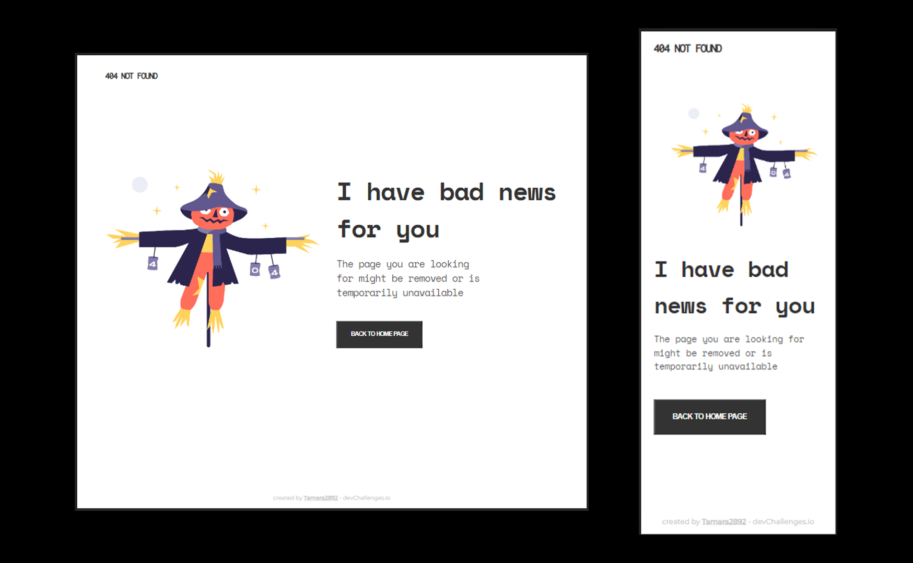

<h1 align="center">{404-not-found}</h1>

   Solution for a challenge from  <a href="http://devchallenges.io" target="_blank">Devchallenges.io</a>.

  <h3>
    <a href="https://404-notfound1.netlify.app/}">
      Demo
    </a>
     | 
    <a href="https://github.com/tamara2892/404-not-found">
      Solution
    </a>
     | 
    <a href="https://devchallenges.io/challenges/wBunSb7FPrIepJZAg0sY">
      Challenge
    </a>
  </h3>

<!-- TABLE OF CONTENTS -->

## Table of Contents

- Página Responsive con el código de error 404 no encontrado
- [Contacto](https://github.com/tamara2892)

<!-- OVERVIEW -->

## Overview

Introduce your projects by taking a screenshot or a gif. Try to tell visitors a story about your project by answering:

- Where can I see your demo? Página web Responsive con el código de error 404 no encontrado

### Built With

<!-- This section should list any major frameworks that you built your project using. Here are a few examples.-->

- [HTML]((https://lenguajehtml.com/))
- [CSS]((https://lenguajecss.com/))

## Features

<!-- List the features of your application or follow the template. Don't share the figma file here :) -->

This application/site was created as a submission to a [DevChallenges](https://devchallenges.io/challenges) challenge. The [challenge](https://devchallenges.io/challenges/wBunSb7FPrIepJZAg0sY) was to build an application to complete the given user stories.

## Contact

- GitHub [@tamara2892](https://{github.com/tamara2892})
